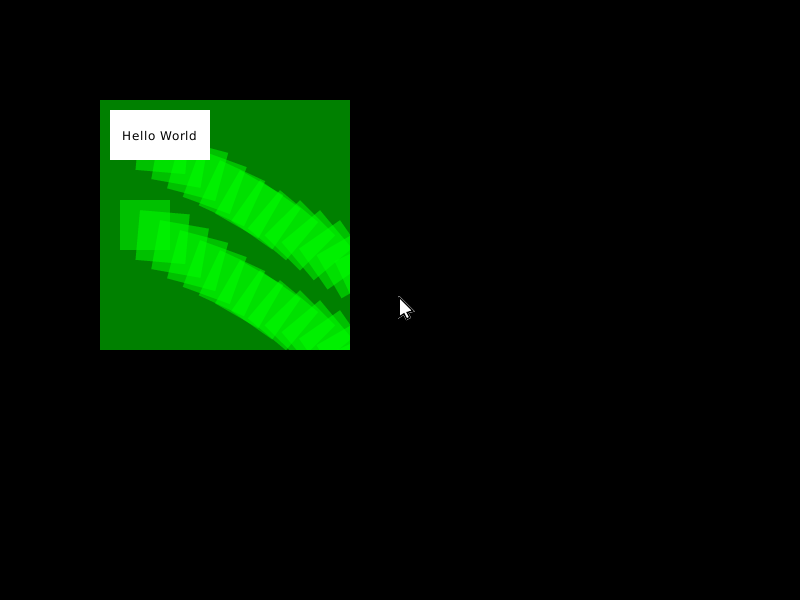

A Rust operating system
=======================

Based on the [Rust barebones kernel](https://github.com/thepowersgang/rust-barebones-kernel).

Rustdocs for the kernel: http://1tgr.github.io/rust-os/kernel/

Features:
 - Targets 64-bit x86
 - Kernel has embedded unit tests
 - Scheduler
   - Threads
   - Processes
 - Memory manager
   - Demand paging
   - Memory protection
   - Shared memory
 - Input and output
   - Keyboard input
   - Mouse input
   - Text-mode output
   - Linear frame buffer (on QEMU/Bochs/VirtualBox)
 - User mode
   - Separation between user mode (ring 3) and kernel mode (ring 0)
   - Syscall interface (via SYSCALL/SYSRET instructions)
   - C runtime (Newlib)
   - Cairo graphics
 - Graphics compositor

Works in progress:
 - Window system

Todo:
 - Window system
 - File system
 - Networking

Wallpaper credit: [by Dollar Gill on Unsplash](https://unsplash.com/photos/aXw8_Mk0LXU)
